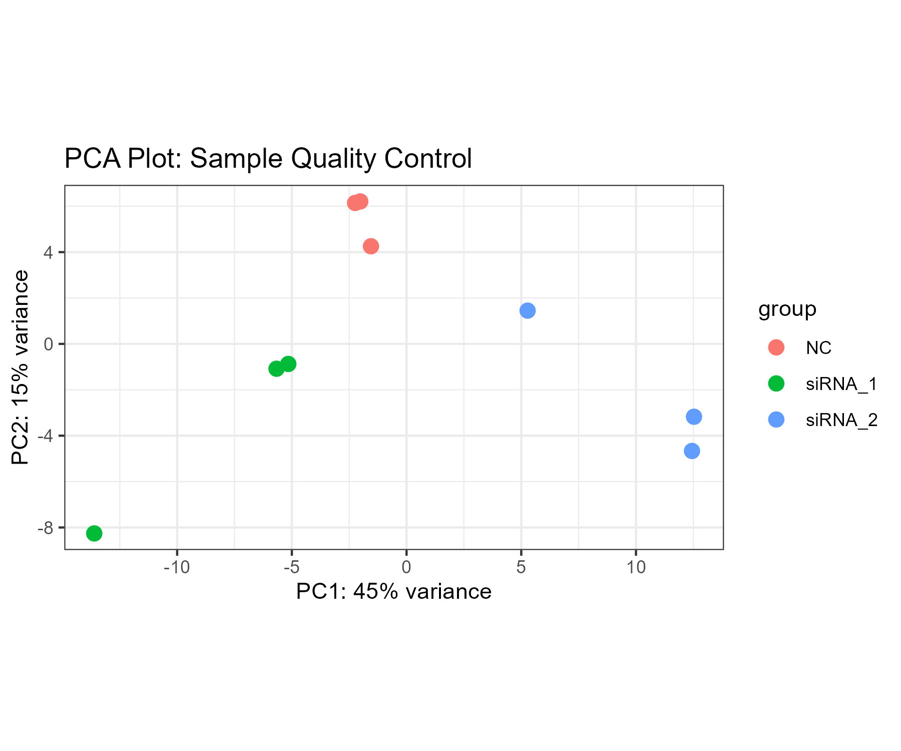
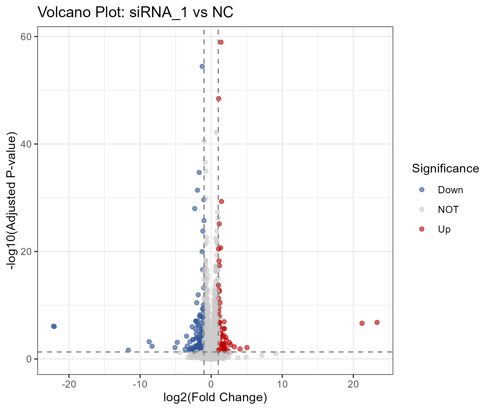
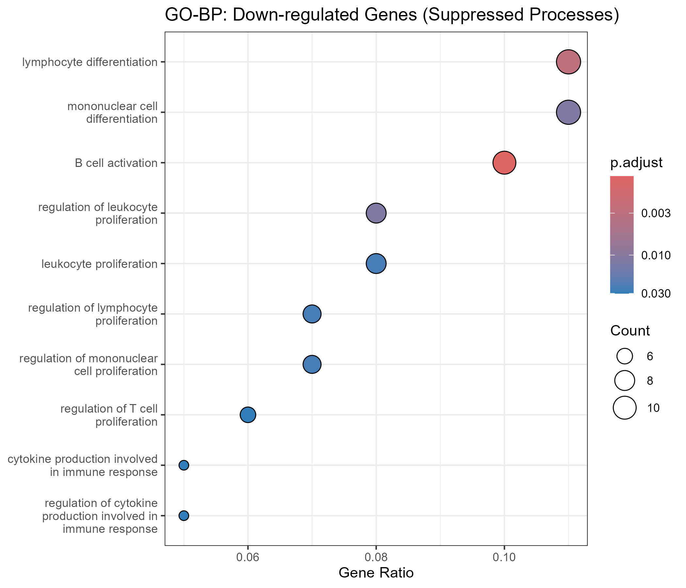
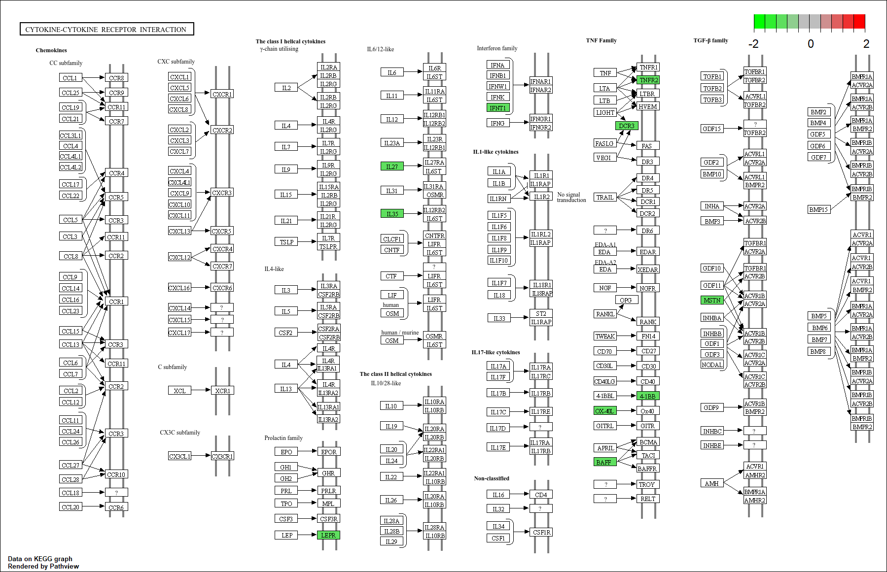

# EXOSC10-AS1 Knockdown Transcriptomic & Functional Enrichment Analysis


## 项目简介
本项目针对 lncRNA **EXOSC10-AS1** 在结直肠癌细胞系（HCT116）中的敲除转录组数据（GSE289213）进行了系统的差异表达分析（DEG）与功能富集挖掘。

通过对 **NC (Control)** 与 **siRNA-knockdown** 组的比较，结合 **GO (BP/CC/MF)** 与 **KEGG Pathway (Pathview)** 分析，系统揭示了敲除 `EXOSC10-AS1` 后的分子机制响应。

---

## 核心生物学发现 

1. **差异表达特征 (DEGs)**：
   * 在 `siRNA_1 vs NC` 比较中，筛选得到 **283 个显著差异基因**（**p.adjust < 0.05, |log2FC| > 1**），其中 **193 个基因表达下调**，**90 个基因表达上调**。
2. **细胞功能失活 (GO Enrichment)**：
   * **BP (Biological Process)**：主要关停了免疫细胞分化与细胞因子产生（`cytokine production`）。
   * **CC (Cellular Component)**：显著破坏了胞质囊泡腔结构（`cytoplasmic vesicle lumen`）。
   * **MF (Molecular Function)**：阻断了细胞因子受体结合（`cytokine receptor binding`）。
3. **经典通路响应 (KEGG Signaling Pathway)**：
   * 富集映射落于 **`Cytokine-cytokine receptor interaction` (hsa04060)** 官方通路。
   * 通过 `pathview` 基因标色进一步证实：敲除后重点下调了 **TNF 家族受体（如 TNFR2, 4-1BB）** 与 **IL27/IL35** 调控网络，阻断了细胞外信号通讯。

---


## 分析成果展示

| 分析模块 | 结果展示 | 说明 |
| :--- | :---: | :--- |
| **样本质控 (PCA)** |  | 样本重复性良好，NC 与 siRNA 组明显分离 |
| **差异基因筛选** |  | 火山图展现显著上下调基因分布 |
| **GO-BP 富集 (下调)** |  | 纯下调基因显著集中于免疫与细胞因子过程 |
| **KEGG 官方地图高亮** |  | 下调基因（绿框）高亮映射至 hsa04060 通路 |

---


##  目录结构

```text
.
├── README.md                                                  # 项目说明文档
├── EXOSC10-AS1.Rproj                                          # RStudio 项目启动文件
├── data/                                                      # 表达矩阵数据与 DEG 导出表格
│   ├── GSE289213_Genes_expression.xlsx
│   ├── DEG_results_siRNA1_vs_NC.csv
│   └── GO_BP_down_results.csv
├── figures/                                                   # 分析导出的可视化高清图表
│   ├── 001_QC_PCA.png
│   ├── 002_Volcano.png
│   ├── 003-1_up_Top10_heatmap.png
│   ├── ...
│   └── 008-1_hsa04060.pathview.png
└── scripts/                                                   # 模块化分析代码
    ├── 01_prepare_and_QC.R   								   # 数据质控与 PCA
    ├── 02_volcano_and_top10.R  							   # DESeq2 计算与热图
    ├── 03_GO_enrichment.R     								   # GO 细分维度富集分析
    └── 04_KEGG_and_pathview.R  							   # KEGG 富集与 pathview 通路映射
```


## 环境依赖与快速复现

### 1. 依赖包安装

脚本内集成了 `pak` 自动化包管理，也可以手动安装核心依赖：

```
if (!requireNamespace("BiocManager", quietly = TRUE)) install.packages("BiocManager")
BiocManager::install(c("DESeq2", "clusterProfiler", "org.Hs.eg.db", "pathview", "pheatmap"))
install.packages(c("tidyverse", "readxl"))
```


### 2. 代码运行说明

在根目录中新建 R project，按顺序运行 `scripts/` 下的 4 个脚本即可完整复现所有分析及图表：

1. `001_prepare_and_QC.R`
2. `002_volcano_and_top10.R`
3. `003_GO_enrichment.R`
4. `004_KEGG_and_pathview.R`


---

## 调试与技术避坑记录

在分析过程中，针对生信数据的特殊性与软件工具的兼容性，完成了以下核心问题的排查与解决：

### 1. 数据的整型校验与 DESeq2 容错
* **遇到问题**：DESeq2 强制要求输入原始 Count 矩阵必须为**非负整数**。如果数据中包含浮点数或数据类型转换不彻底，会导致 `DESeqDataSetFromMatrix()` 直接报错中断。
* **排查与解决**：在构建 `dds` 对象前，增加了严格的自动化逻辑检测与类型转换：
  ```R
  # 校验是否全为整数并强制转换类型
  stopifnot(all(raw_df[, -1] %% 1 == 0))
  mode(counts_matrix) <- "integer"


### 2. 火山图基因标签遮挡与信息可视化解耦

- **遇到问题**：尝试在单张火山图中直接标记 Top 差异基因的文本标签（`ggrepel`）时，标签容易遮挡重要的表达数据点，且单图承载信息过载，阅读体验不佳。
- **排查与解决**：采用**可视化解耦策略**。不再强行挤在单张火山图上展示，而是保留无遮挡的标准火山图展示总体分布，并额外将上调 Top 10 与下调 Top 10 提取出来，独立绘制表达量聚类热图进行深度解析。


### 3. 上下调基因混合分析导致的功能掩盖

- **遇到问题**：初始将所有 DEG（上调+下调）混合进行 GO-BP 分析时，上调基因（细胞应答/代偿）与下调基因（免疫关停）的功能相互干扰，导致核心生物学故事不清晰。
- **排查与解决**：改用**拆分分析策略，将基因集严格拆分为纯下调（193个）与纯上调（90个）。发现敲除 `EXOSC10-AS1` 主要是直接关停了 `cytokine production` 与囊泡结构。


### 4. GO 分析中上调基因集无显著富集

* **遇到问题**：在运行纯上调基因（90个）的 GO-BP 富集分析时，即使在标准阈值下（`pAdjustMethod = "BH"`, `p.adjust < 0.05`），系统也未吐出任何具有统计学显著性的 GO 条目，导致无法绘制纯上调基因的 GO 气泡图。
* **排查与解决**：确认代码与算法逻辑无误，现象源于上调基因数量相对较少（仅 90 个），且功能分布极为离散，未在特定生物学通路中形成统计学显著的聚集（Cluster）。因此项目中选择重点展示“全局基因 GO-BP 概览”与“纯下调基因 GO-BP/CC/MF 深度解析”。


### 5. KEGG 分析中在线数据库的网络连接与接口超时

- **遇到问题**：`clusterProfiler::enrichKEGG()` 与 `pathview` 需要实时向日本 KEGG 官方服务器发送 API 请求。在特定网络环境下，常因连接超时或 SSL 握手失败导致分析中断。
- **排查与解决**：出现“连接超时”相关报错时，需要优先检查与日本 KEGG 官方服务器的连接情况，必要时配置 RStudio 代理访问或离线缓存数据库，确保 KEGG 数据抓取的稳定性。常见的解决方案是在VPN中设置“全局接管”或者TUN服务模式。


### 6. KEGG 分析中 ENSEMBL ID 的映射缺失问题

- **遇到问题**：`enrichKEGG()` 无法识别 Ensembl ID (`ENSG...`)，且直接转换容易因部分基因在 NCBI 数据库中缺乏定义而导致数据丢包。
- **排查与解决**：引入 `clusterProfiler::bitr()` 进行 ID 映射，并使用 `na.omit()` 过滤非匹配项；同时通过逻辑检查，确保转换后的 `ENTREZID` 保持足够的覆盖率。


